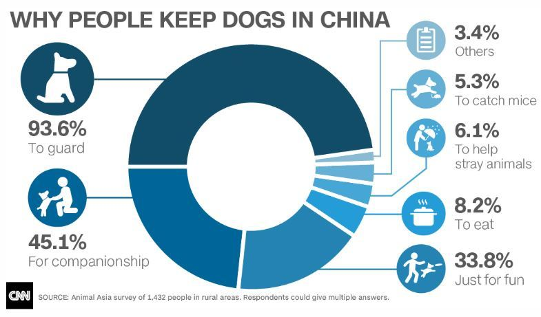
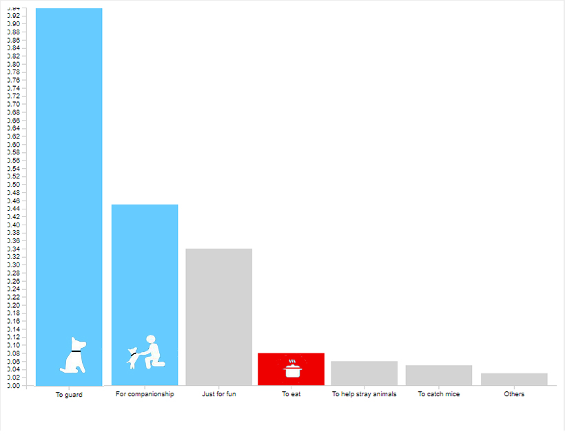

# Redesign "Why do people keep dogs in China" Chart for better visualization
  

  
The original visualization was published on CNN, and was widely used (https://www.nbc-2.com/story/29376304/dog-lovers-and-dog-eaters-square-off-at-chinas-yulin-festival). As someone who oppose eating dogs, I find this chart not informative enough to communicate with its audeince, which are those who care about people fighting for the ethical treatment of dogs in China. This chart has some pros and cons, so I will identify them, and redeisgn one.
 
Cons:  
The original chart was not informative, and was ugly. It is depicted in a pie chart, but the percentage does not add up to 100% because survey respondents are allowed to make multiple choices. Moreover, there are too many parts clustered inside the pie chart, making it hard to read. The color scheme, although making it easier to identify one group from another, does not mean anything.
  
Pros:  
The icons look nice. You can rarely see "pot" icon in a chart about dogs.  

How I planned to redesign it:  
I tried three alternatives. 
  
The first was a bar chart putting all groups on X-Axis, and respective values on Y-Axis. Paint "Guard", "companionship" and "for fun" in blue, while painting "to eat" in red. Painting "to eat" in red will make it standout, and placing the "pot" icon on the bar will force people to connect "dog" with "food" to trigger their sympathy. Other bars are left light grey to blur into the background so they do not interfere with the main narrative, which is depicting the existance of "keeping dogs to eat".
  
The Second was a Beeswarm, but after I wireframe it I found it frustrating to look at, so I ditch this plan on the spot.
  
The third was a horizontal stacked bar chart. The color scheme is the same as the normal bar chart.

Feedbacks:  
I showed some of my friends the first and third alternatives, and ask for their first reaction.
  
All of them told me that the stacked bar chart makes no sense as there is no time series comparison.
  
Some of them told me that they take issue with painting "for fun" blue. According to their statements, "for fun" sometimes have twisted meanings, for example, "animal abuse" sometimes can be considered "for fun" by some twisted people, so I would better leave it grey.
  
One reviewer said that I should paint "guard" and "companionship" in two different blue instead of one, but others said that it is fine.

Final Visual:
  
Why Do People Keep Dogs in China

  
P.S. Blue color code is #66ccff, and red color code is #ee0000. Because I like those two color tones.
  
[Back to portfolio homepage](https://barrychen825.github.io/chen-portfolio/)
