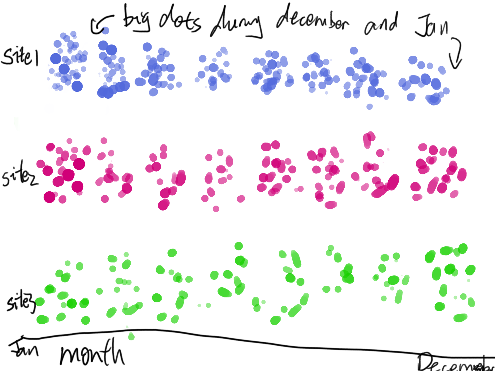
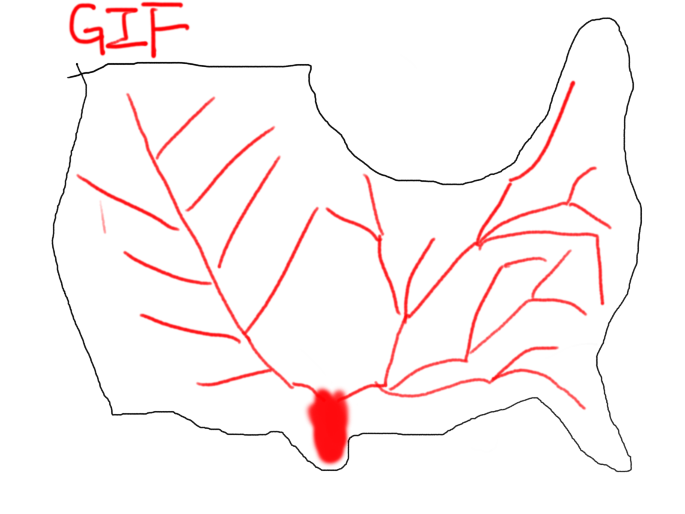

# Don't run around naked, put a mask on at least (WIP)
  **Part 1: Proposal**   
  **Statement:**     
  Don't run around naked, put a mask on at least (WIP)  
  **Audience:**   
  People living in Pittsburgh, who care about their own health  
  **Purpose:**   
  Get people to wear procedure mask/N95 respirator during winter  
  **Summary:**   
  Pittsburgh's air quality has been one of the worst among cities in the nation. PM2.5 plays an important role in pollution, especially during winter. Influenza, which uses droplet infection to spread, will occure during winter as well. Wearing N95 respirator during winter, therefore, will not only protect people's lung from PM2.5, but also prevent influenza infection.  
    
    
  **Outline and sketches:**  
  Explain what is PM2.5, using picture if possible.  
  Use Beeswarm graph to show PM2.5 level in Pittsburgh through 2019. (Data visualization)  
    
  Present N95 respirator, emphasizing its ability to filter out PM2.5 particles.  
  Present influenza graph on a US map, with animation describing how influenza spread in the nation. (Data visualization)  
      
  Present how droplet infection works, preferably with video.  
  Present procedure mask, emphasizing its ability to prevent germ from drop let infection with price much less than that of N95.  
  Present health care spending related to PM2.5 and influenza for a final push. _**(Still need data)**_  
  
  **Data:**  
  [PM2.5](https://github.com/Barrychen825/chen-portfolio/blob/master/pit%20pm2.5.csv)  
  [Influenza](https://github.com/Barrychen825/chen-portfolio/blob/master/Influenza%20map.csv)  
  **Data Link:**   
  https://www.epa.gov/outdoor-air-quality-data/download-daily-data (PM2.5)  
  https://www.cdc.gov/flu/weekly/index.htm#ILIActivityMap (influenza spreading)  
    
  **Method:**  
  Shorthand, with embeded images and videos
  
  
  
[Back to portfolio homepage](https://barrychen825.github.io/chen-portfolio/)
