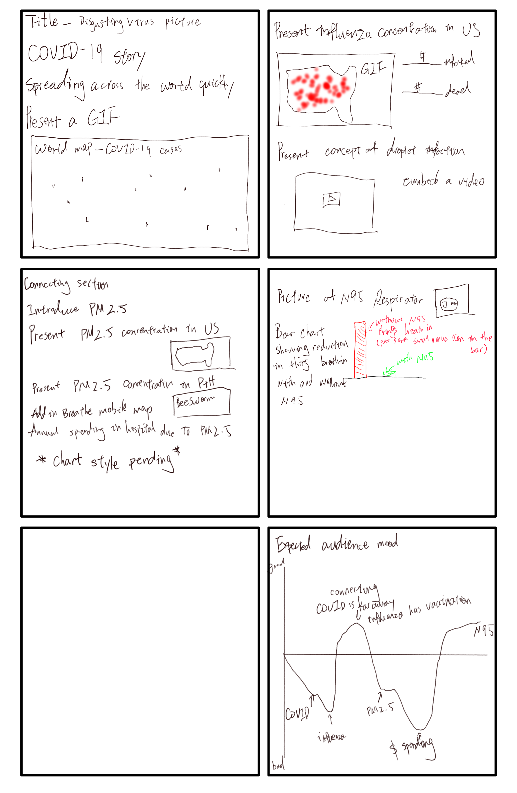
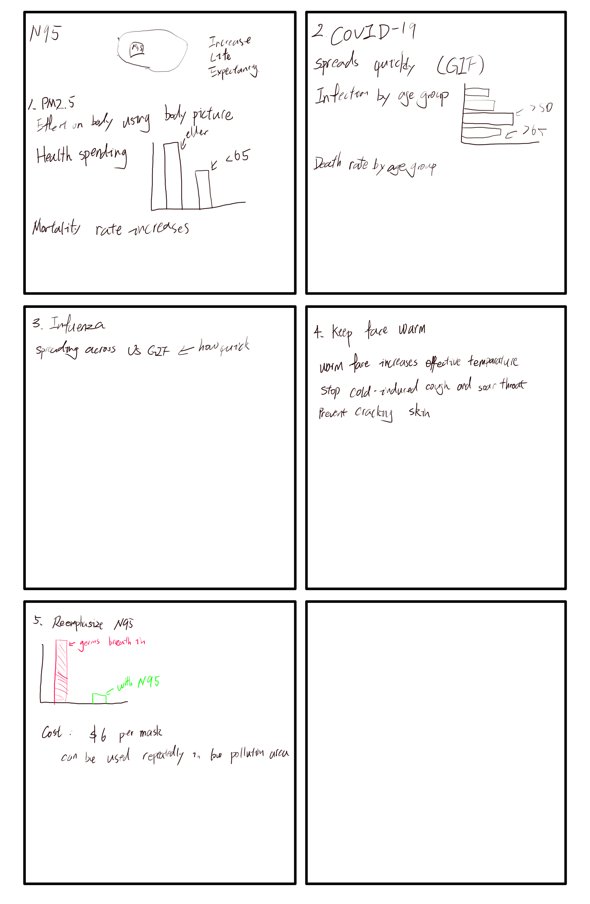

# Project Part II  
  After the [outline](https://barrychen825.github.io/chen-portfolio/final_project.html) overhaul, a storyboard was drawn to describe the project.  
    
  As my audience are those who do not currently wear respirator frequently during winter, I distributed user survey, after a brief presentation using storyboard, to 5 people who I know that do not wear respirator.  
  2 of them are my friends at Heinz College. They are living in Pittsburgh, and do not feel the need to wear respirator or procedure mask during winter.  1 international student, and another is native student whose family lives in Pittsburgh.  
  1 of them is my friend who currently lives in Irvine, California. She works at a pharmaceutical lab, but claims that a respirator is overkill for daily use.  
  1 of them is a friend of mine who currently lives in Beijing, China. Although there are hundreds of COVID-19 carriers in Beijing, he only wears procedure masks while having access to N95 respirators.  
  1 of them is a friend of mine who currently lives in Shanghai, China. Shanghai is close to Wuhan, so theoretically he should wear N95 respirator to avoid infection. He, however, claims that people are over-reacting.  
  The survey consists of 6 questions:  
  1. What is the primary reason why you do not wear N95 respirator?    
  2. Did you know these information before?  
  3. What do you think I am trying to do?  
  4. Anything confusing?  
  5. What is the first word you can come up with after reading the story board?  
  6. Do you want to start wearing N95 respirator now?  
    
  The answers to each questions are documented below:  
    
  1. The answers are blurry as most of them mentioned that it is unnecessary. One person said that it is too expensive to use one N95 repirator per day.  
  2. All of them know that COVID-19 is spreading wildly, but none of them know neither influenza's spreading nor PM2.5 induced health spending.  Only 1 person did not know N95's utility.  
  3. They all said that I want to persuade people to wear N95 respirator. This is not exactly accurate as I want people to wear N95 respirator during winter.  
  4. Some said that the "story" is not really a story, and it is merely spitting out facts. And since COVID-19 is far from US, and influenza has vaccination, then why do they need to wear respirator? One person stated that I present the most serious COVID-19 first, and then claims that it is not important, weakens the persuasion.  
  5. Respirator  
  6. The person in Irvine, California still says that it is unnecessary to wear respirator because nothing is affecting Irvine, and Irvine is too hot to get a flu. The international student in Heinz said that he still will not wear N95 because there is no source of COVID-19 in Pittsburgh, and he is afraid of being discriminated against according to multiple news coverage of people discriminating against Chinese wearing respirators.  
  
  On Feburary 18th, I had an extensive conversation with the person working at pharmaceutical lab, and I have overhauled the entire outline and wireframe to make it much more informative and logical. (Wireframe in progress)  
    
  Building on the feedbacks, I altered my storyboard as follows:  
  The purpose is still "getting people to wear N95 respirator", but I have narrowed down my audience to elderly people over 65 years old, so I put the age range into the call to action.  
  I put emphasis on mortality and extra health spending to get elderly people's attention because those are what they care about.  
  
  
  
  
  
  
  
    
[Back to portfolio homepage](https://barrychen825.github.io/chen-portfolio/)
